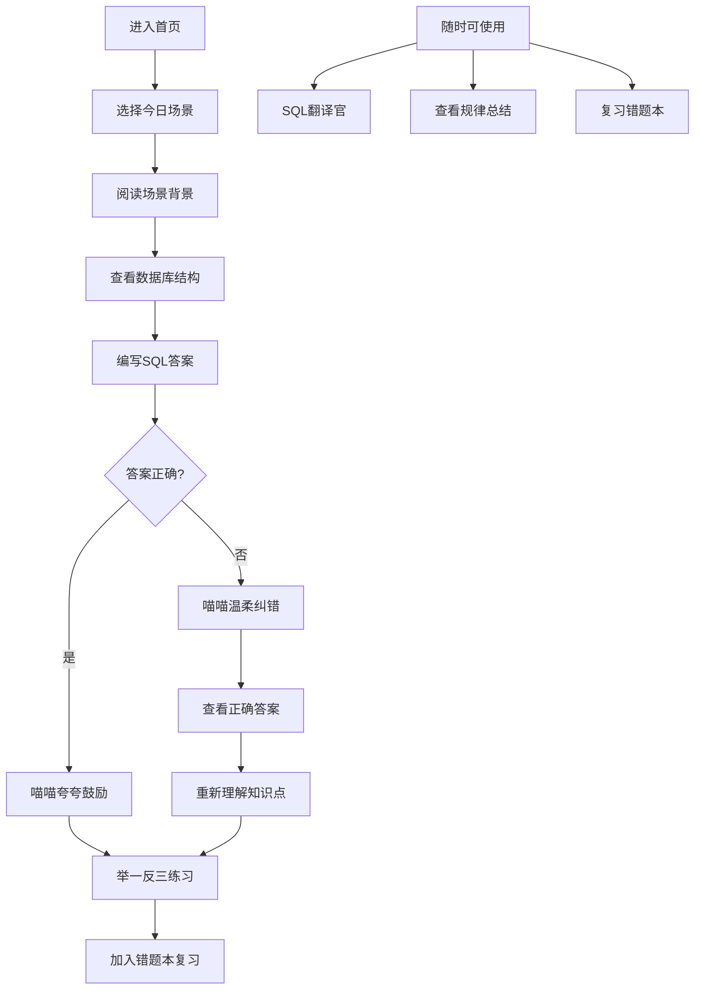
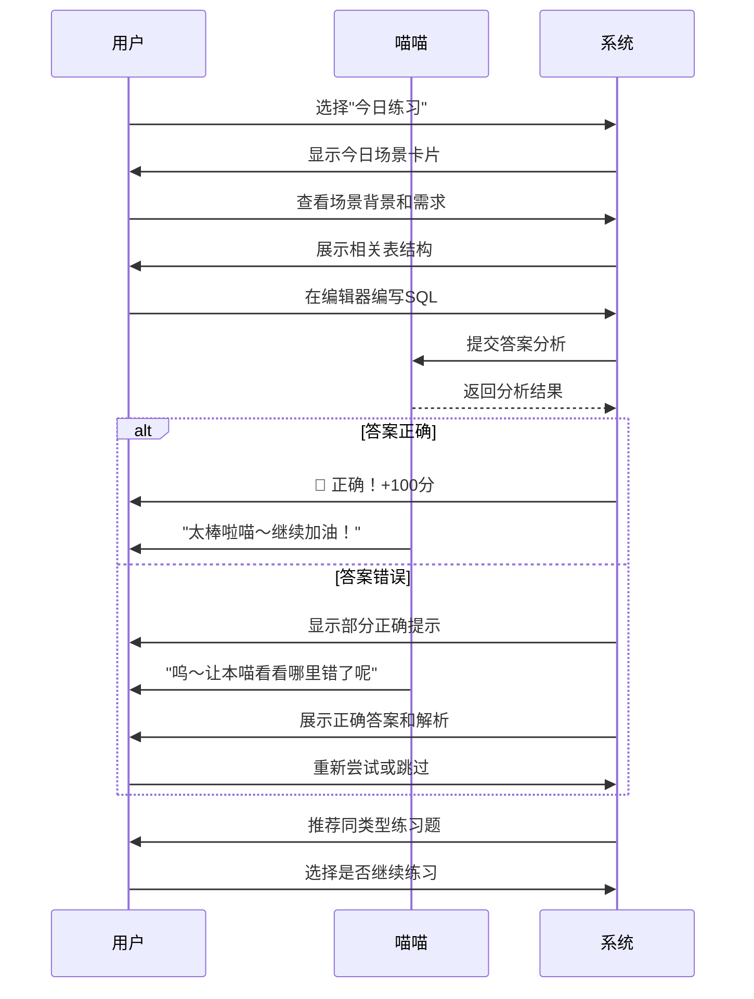

# MySQL面试训练营 - 产品需求文档

## 1. 产品概述

**喵SQL - MySQL面试训练营** 是一款专为计算机专业学生和初级开发者打造的MySQL学习平台，通过模拟互联网大厂真实面试场景，采用轻松有趣的教学方式（AI小猫助手"喵喵"全程陪伴），帮助用户在找工作面试中快速掌握MySQL核心技能。

### 核心价值
- 🎯 **面向实战**：所有练习题均来源于字节跳动、阿里巴巴、腾讯、美团等大厂真实面试题库
- 🐱 **AI助教陪伴**：圆滚滚的黑色小猫"喵喵"全程陪伴，用可爱的语气引导学习、指正错误
- 📚 **循序渐进**：每天一个场景练习，配合艾宾浩斯记忆曲线，科学安排复习节奏
- 💡 **通俗易懂**：用生活化的比喻解释复杂概念，让抽象的SQL语句变得触手可及

### 目标用户
- 计算机专业在校学生（准备校招）
- 转行学习编程的初学者
- 需要系统复习MySQL的求职者
- 对数据库感兴趣的爱好者

---

## 2. 核心功能

### 2.1 用户角色

| 角色 | 使用方式 | 核心权限 |
|------|---------|---------|
| 学习者 | 无需注册，直接使用 | 全部学习功能、错题本、学习记录 |

> **注**：本期MVP版本为单用户模式，无需登录系统，所有学习数据存储在本地localStorage。

### 2.2 功能模块

#### 模块一：SQL翻译官 🐱
**入口位置**：首页导航 + 底部固定入口
**功能描述**：用户输入任意SQL语句，小猫"喵喵"用生动有趣的语言解释其含义，帮助小白真正理解每一条SQL在做什么。

**核心特性**：
- 支持输入框输入SQL语句
- 一键美化/格式化SQL
- "喵喵"逐词解析，用比喻和例子帮助理解
- 相关知识点卡片推荐
- 一键收藏到学习笔记

**示例解释**：
```
输入：SELECT name, age FROM users WHERE age > 18 ORDER BY age DESC;

喵喵解释：
"小鱼干！这个语句是要从【users】这张大表格里...
  1. 先找到年龄大于18岁的小猫咪们
  2. 按年龄从大到小排个队
  3. 只需要名字和年龄两个信息哦～
喵～学会了没有呀？"
```

#### 模块二：场景练习场 🎯
**入口位置**：首页卡片 + 导航栏
**功能描述**：每天推送一个互联网大厂真实工作场景，用户需要在编辑器中写出正确的SQL，然后获得AI即时反馈和辅导。

**核心流程**：
1. **场景展示**：展示业务背景（如"电商平台需要统计每日销量"）
2. **需求描述**：明确需要完成的SQL任务
3. **数据库结构**：展示相关的表结构（字段、类型、关系）
4. **用户作答**：在代码编辑器中编写SQL
5. **AI批改**：
   - 喵喵先给鼓励（即使错了也要温柔指出）
   - 逐行分析用户的SQL
   - 指出错误点和优化建议
   - 给出正确答案和详细解析
6. **举一反三**：根据当前题目，推荐1-2道同类变体练习

**每日场景示例**：
```
【场景】字节跳动 - 电商部门
【背景】运营团队需要分析用户的购买行为，优化推荐算法
【任务】找出购买次数超过5次且累计消费超过1000元的"高价值用户"
【涉及表】orders（订单表）、users（用户表）
【难度】★★☆☆☆
【考点】多表连接、分组聚合、HAVING子句
```

#### 模块三：规律总结本 📖
**入口位置**：导航栏
**功能描述**：系统性地总结MySQL高频考点和记忆技巧，帮助用户建立知识框架。

**核心内容**：
- **按模块分类**：
  - 查询基础（SELECT、WHERE、ORDER BY）
  - 分组与聚合（GROUP BY、HAVING、聚合函数）
  - 多表查询（JOIN、UNION、子查询）
  - 数据操作（INSERT、UPDATE、DELETE）
  - 表结构设计（CREATE、ALTER、索引）
  - 事务与锁（ACID、隔离级别）

- **每个知识点包含**：
  - 一句话概括（超容易记住的口诀）
  - 语法结构图解
  - 面试高频问法
  - 1-2道精选例题
  - 喵喵的记忆小贴士

**记忆口诀示例**：
```
📝 WHERE和HAVING的区别
"喵～WHERE是筛选师，分组之前先过滤
   HAVING是复核官，分组之后来审查
   聚合函数想筛选，只能派HAVING上场！"
```

#### 模块四：错题本 📕
**入口位置**：导航栏 + 每道题后的"加入错题本"按钮
**功能描述**：自动记录用户的错题，并提供针对性的复习功能。

**核心功能**：
- **错题收集**：练习中答错的题目自动/手动加入
- **错题分类**：按知识点、按难度、按时间分类
- **复习提醒**：基于艾宾浩斯遗忘曲线，智能提醒复习
- **重新挑战**：从错题库随机抽取题目重新作答
- **进步统计**：显示错题攻克进度（多少已掌握、多少还需努力）

#### 模块五：AI喵喵助手 🐱
**入口位置**：右下角悬浮按钮
**功能描述**：随时呼出的AI助手，以小猫的形象和语气回答用户问题。

**交互方式**：
- 点击悬浮按钮展开对话面板
- 支持文字输入
- 喵喵的语气特点：
  - 常用"喵～"、"小鱼干～"、"本喵"等可爱用语
  - 错误时会说"呜～这里要注意哦"
  - 正确时会夸"太棒啦！小天才喵～"
  - 解释时用很多生活比喻

**能力范围**：
- 解答MySQL语法疑问
- 分析用户写的SQL对不对
- 提供学习建议和计划
- 鼓励用户继续学习

---

## 3. 核心流程

### 3.1 用户学习路径



### 3.2 每日练习流程



---

## 4. 用户界面设计

### 4.1 设计风格

**整体定位**：简约、轻盈、温暖、专业

**色彩系统**：
| 用途 | 颜色 | 色值 | 说明 |
|------|------|------|------|
| 主色调 | 柔雾紫 | `#8B5CF6` | 活力、专注、智慧 |
| 辅助色 | 薄荷绿 | `#10B981` | 成功、正确、鼓励 |
| 警示色 | 珊瑚橙 | `#F97316` | 错误、提醒、需注意 |
| 强调色 | 天空蓝 | `#3B82F6` | 信息、链接、交互 |
| 背景色 | 米白 | `#FAFAFA` | 干净、舒适、轻盈 |
| 深色文字 | 墨灰 | `#1F2937` | 主要文字 |
| 浅色文字 | 灰白 | `#6B7280` | 次要文字 |

**字体系统**：
- **标题字体**：思源黑体（Noto Sans SC）- Bold/Medium
- **正文字体**：Inter - Regular
- **代码字体**：JetBrains Mono / Source Code Pro
- **喵喵字体**：可爱手写风格（Ma Shan Zheng / ZCOOL KuaiLe）

**圆角系统**：
- 小元素：8px
- 卡片：16px
- 模态框：24px
- 大容器：32px

**阴影系统**：
- 柔和阴影：`0 4px 6px -1px rgba(0, 0, 0, 0.1)`
- 悬浮阴影：`0 10px 15px -3px rgba(0, 0, 0, 0.1)`
- 喵喵气泡：`0 20px 25px -5px rgba(139, 92, 246, 0.15)`

### 4.2 页面设计概览

#### 首页（Home）
**布局**：单页滚动式

| 模块 | 设计要点 |
|------|---------|
| 顶部导航 | 固定顶部，毛玻璃效果背景 |
| Hero区域 | 大标题 + 喵喵插画 + 快速开始按钮 |
| 今日场景 | 醒目的"今日练习"卡片，有倒计时提示 |
| 功能入口 | 4个主要功能的大图标卡片网格 |
| 学习进度 | 环形进度图 + 连续打卡天数 |
| 底部 | 喵喵悬浮助手按钮 |

**动画效果**：
- 页面加载：卡片依次浮入（stagger 100ms）
- 滚动：元素渐显（Intersection Observer）
- 按钮：悬停时轻微上浮 + 阴影加深
- 喵喵：轻微上下浮动 + 眨眼动画

#### SQL翻译官页面
**布局**：左右分栏（编辑器 + 解释面板）

| 区域 | 元素 |
|------|------|
| 顶部 | 页面标题 + 功能说明 |
| 左侧 | SQL输入框（代码编辑器样式，行号显示）|
| 右侧 | 喵喵解释卡片（气泡样式）|
| 底部 | 格式化按钮 + 复制按钮 + 收藏按钮 |

**交互**：
- 输入时：实时语法高亮
- 点击"翻译"：喵喵头像出现动画，解释逐词/逐句展示
- 悬停关键词：显示小tooltip解释

#### 场景练习页面
**布局**：垂直分步流程

| 步骤 | 内容 |
|------|------|
| 步骤1 | 场景卡片（公司Logo + 场景描述 + 难度星级）|
| 步骤2 | 数据库结构可视化（表格卡片 + 字段列表）|
| 步骤3 | 需求描述框 + 代码编辑器 |
| 步骤4 | 提交按钮 |
| 步骤5 | 结果展示区（正确/错误 + 喵喵反馈）|

**编辑器特性**：
- 语法高亮（MySQL关键字蓝色、字符串绿色、数字橙色）
- 自动补全提示
- 行号显示
- 占位符提示（placeholder）

#### 规律总结页面
**布局**：左侧导航 + 右侧内容

| 元素 | 说明 |
|------|------|
| 左侧目录 | 按模块分类，可折叠 |
| 顶部标签 | 快速切换：全部 / 查询 / 聚合 / JOIN / 优化 |
| 知识点卡片 | 口诀 + 图解 + 例题 |
| 喵喵贴士 | 每篇都有可爱的记忆小技巧 |

**卡片样式**：
- 圆角16px
- 柔和阴影
- 左侧彩条标识分类
- 悬停时边框变紫色

#### 错题本页面
**布局**：列表 + 详情抽屉

| 区域 | 内容 |
|------|------|
| 统计区 | 总错题数 / 已攻克 / 待复习 |
| 筛选栏 | 按知识点 / 按难度 / 按时间 |
| 错题列表 | 可折叠卡片，显示题目预览 |
| 详情抽屉 | 点击展开完整题目、正确答案、解析 |

**卡片设计**：
- 左侧：难度星级 + 知识点标签
- 中间：题目简述
- 右侧：复习按钮 + 删除按钮
- 攻克后：卡片变绿色 + 显示"已掌握"徽章

### 4.3 响应式设计

**断点设置**：
- 桌面端：≥1024px（三栏布局）
- 平板端：768px - 1023px（两栏布局）
- 移动端：<768px（单栏堆叠，底部导航）

**移动端优化**：
- 底部固定Tab导航
- 编辑器全屏编辑模式
- 喵喵助手简化为文字气泡
- 卡片改为垂直滚动

### 4.4 喵喵助手设计

**外观设计**：
- 形状：圆滚滚的黑色猫咪
- 大小：桌面端80px，悬浮在右下角
- 表情：多种状态（正常、开心、疑惑、得意）
- 动画：轻微浮动 + 眨眼 + 说话时嘴动

**对话气泡**：
- 背景：白色带紫色边框
- 左侧三角指向喵喵
- 右上角有关闭按钮
- 最大高度400px，可滚动
- 新消息有打字机效果

**交互反馈**：
- 点击喵喵：弹起动画 + 气泡弹出
- 发送消息：用户消息右对齐，喵喵回复左对齐
- 回答正确：喵喵表情变开心 + 撒花特效
- 回答错误：喵喵表情变疑惑 + 温柔提醒

---

## 5. 技术约束

### 5.1 前端技术栈

**框架**：React 18 + TypeScript
**构建工具**：Vite
**样式方案**：Tailwind CSS + CSS Variables
**路由管理**：React Router v6
**状态管理**：React Context + localStorage
**代码编辑器**：Monaco Editor 或 CodeMirror
**动画库**：Framer Motion
**图标库**：Lucide React

### 5.2 数据存储

**本地存储方案**：
- 用户学习进度 → localStorage
- 错题本数据 → localStorage
- 收藏的SQL → localStorage
- 每日打卡记录 → localStorage

**数据结构示例**：
```typescript
// 错题数据结构
interface WrongQuestion {
  id: string;
  scenarioId: string;
  userAnswer: string;
  correctAnswer: string;
  wrongPoints: string[];
  timestamp: number;
  mastered: boolean;
  reviewCount: number;
  nextReviewDate: number;
}

// 学习进度数据结构
interface LearningProgress {
  totalPractice: number;
  correctCount: number;
  streakDays: number;
  lastPracticeDate: string;
  masteredTopics: string[];
}
```

### 5.3 性能优化

- 图片懒加载
- 路由懒加载（React.lazy）
- 列表虚拟化（用于错题列表）
- 防抖/节流搜索输入
- 骨架屏加载

---

## 6. 里程碑计划

### MVP版本（第一期）
- ✅ 首页 + 导航
- ✅ SQL翻译官（基础版）
- ✅ 场景练习场（10道精选题目）
- ✅ 错题本（记录 + 复习）
- ✅ 喵喵AI助手（基础对话）
- ✅ 响应式适配

### 后续迭代
- 规律总结模块详细内容
- 每日打卡系统
- 学习数据分析
- 题目库扩充至100+
- 喵喵AI智能辅导增强
