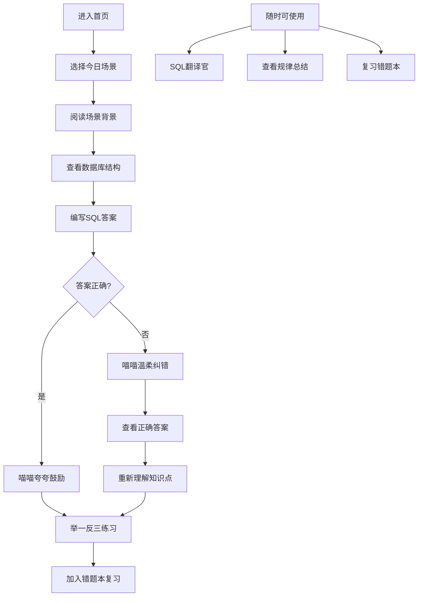
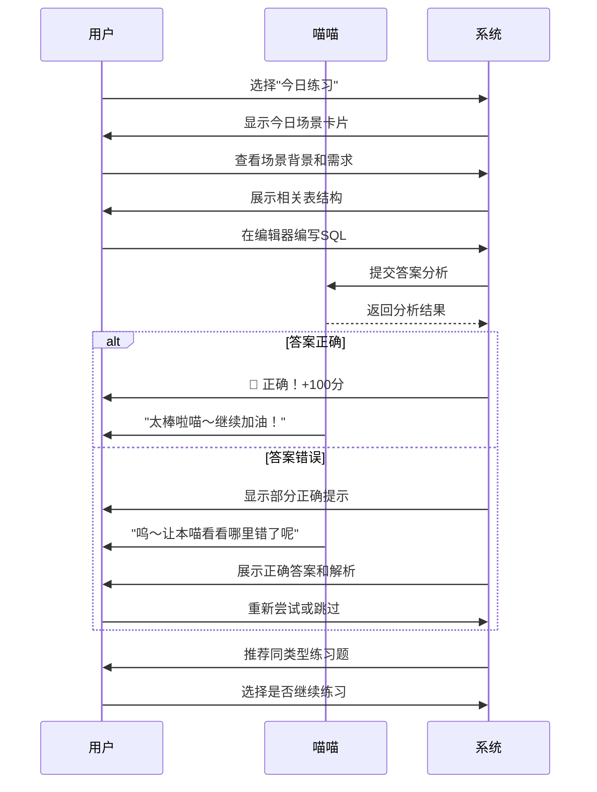

# MySQL面试训练营 - 产品需求文档

## 1. 产品概述

**喵SQL - MySQL面试训练营** 是一款专为计算机专业学生和初级开发者打造的MySQL学习平台，通过模拟互联网大厂真实面试场景，采用轻松有趣的教学方式（AI小猫助手"喵喵"全程陪伴），帮助用户在找工作面试中快速掌握MySQL核心技能。

### 核心价值
- 🎯 **面向实战**：所有练习题均来源于字节跳动、阿里巴巴、腾讯、美团等大厂真实面试题库
- 🐱 **AI助教陪伴**：圆滚滚的黑色小猫"喵喵"全程陪伴，用可爱的语气引导学习、指正错误
- 📚 **循序渐进**：每天一个场景练习，配合艾宾浩斯记忆曲线，科学安排复习节奏
- 💡 **通俗易懂**：用生活化的比喻解释复杂概念，让抽象的SQL语句变得触手可及

### 目标用户
- 计算机专业在校学生（准备校招）
- 转行学习编程的初学者
- 需要系统复习MySQL的求职者
- 对数据库感兴趣的爱好者

---

## 2. 核心功能

### 2.1 用户角色

| 角色 | 使用方式 | 核心权限 |
|------|---------|---------|
| 学习者 | 无需注册，直接使用 | 全部学习功能、错题本、学习记录 |

> **注**：本期MVP版本为单用户模式，无需登录系统，所有学习数据存储在本地localStorage。

### 2.2 功能模块

#### 模块一：SQL翻译官 🐱
**入口位置**：首页导航 + 底部固定入口
**功能描述**：SQL翻译官包含两个子功能：
1. **从零到一学习**（新增）：为SQL零基础小白打造的系统学习路径，用最通俗易懂的语言和可爱的小猫比喻讲解每个知识点，每节配有实际例子和练习题
2. **SQL翻译助手**：用户输入任意SQL语句，小猫"喵喵"用生动有趣的语言解释其含义，帮助用户理解每一条SQL在做什么

**学习路径设计**：
采用游戏闯关模式，学习就像打游戏升级一样有趣！每完成一章学习，解锁下一章，获得成就感喵～

---

##### 🔰 从零到一学习模块（次级功能）

###### 第1章：初识数据库 - 猫咪图书馆的故事 🏠

**概念讲解**：
喵～欢迎来到喵SQL的世界！首先我们来认识一下什么是数据库吧！

想象你有一个超级大的书架📚，上面放满了各种猫咪的信息。这个书架就是**数据库**，而每一本小册子就是**表（Table）**。

比如我们有一本叫 `cats` 的小册子，里面记录着每只小猫咪的名字、年龄、喜欢的食物等信息：

```
cats 表（猫咪信息表）
┌────────────┬─────┬────────────┐
│ name       │ age │ favorite   │
├────────────┼─────┼────────────┤
│ 橘喵       │ 3   │ 鱼干       │
│ 布偶       │ 2   │ 猫罐头     │
│ 狸花       │ 5   │ 小鱼       │
└────────────┴─────┴────────────┘
```

**生活比喻**：
- **数据库**就像是一个城市，里面有很多栋楼（表）
- **表**就像是一个楼层，里面有很多房间（每行数据）
- **字段**（列）就像是房间的不同属性，比如面积、用途、价格
- **记录**（行）就是具体的某一个房间

**本章练习**：
🎯 **任务**：假设你有一个 `students` 学生信息表，包含 name（姓名）、age（年龄）、grade（年级）字段，请思考：这个表里"三年级"、"10岁"、"小明"分别是什么？

✅ **答案解析**：
- "三年级" → grade字段的一个可能的值
- "10岁" → age字段的一个可能的值
- "小明" → name字段的一个可能的值，也是某一行记录的名字

---

###### 第2章：SELECT初体验 - 挑选你想要的猫咪 🐾

**概念讲解**：
SELECT 是SQL中最最最重要的命令了！它的意思就是"挑选"，从表中挑选出我们想要的数据。

**最基础的查询**：
```sql
SELECT * FROM cats;
```
喵喵解释："这条命令是说，从 cats 表里，把所有的猫咪信息都给我找出来！"

星号 `*` 代表"所有字段"，FROM 后面跟的是表名。

**只查询部分字段**：
```sql
SELECT name, age FROM cats;
```
喵喵解释："这条命令是说，从 cats 表里，我只需要猫咪的名字和年龄，其他的不用告诉我喵～"

**添加筛选条件 WHERE**：
```sql
SELECT name FROM cats WHERE age > 3;
```
喵喵解释："小鱼干！这条是说，从 cats 表里，找出年龄大于3岁的猫咪，只给我看它们的姓名！"

**排序展示 ORDER BY**：
```sql
SELECT name, age FROM cats ORDER BY age DESC;
```
喵喵解释："这条是说，从 cats 表里，把猫咪按年龄从大到小排个序，然后告诉我名字和年龄喵～"

- ASC = 从小到大（升序）
- DESC = 从大到小（降序）

**限制数量 LIMIT**：
```sql
SELECT name FROM cats ORDER BY age DESC LIMIT 2;
```
喵喵解释："这条是说，找出最年长的2只猫咪的名字！"

**生活比喻**：
SELECT 就像是你去超市买东西：
- `SELECT *` = 买下整个货架的所有东西
- `SELECT name, price` = 只买名字和价格标签
- `WHERE price < 100` = 只要100元以下的
- `ORDER BY price ASC` = 按价格从低到高排队
- `LIMIT 5` = 只买前5个

**本章练习**：
🎯 **任务**：从 `products` 商品表中，查询价格（price）低于50元的产品名称（product_name），按价格从低到高排序，只显示前10个。

```sql
-- 你的答案：
SELECT ________ FROM ________ WHERE ________ ORDER BY ________ ________ LIMIT ________;
```

✅ **正确答案**：
```sql
SELECT product_name FROM products WHERE price < 50 ORDER BY price ASC LIMIT 10;
```

---

###### 第3章：WHERE详解 - 精准筛选的艺术 🔍

**概念讲解**：
WHERE 是用来"筛选"的命令，就像你用筛子筛面粉一样，只留下符合条件的东西。

**基础比较运算符**：

| 运算符 | 含义 | 举例 |
|--------|------|------|
| `=` | 等于 | `WHERE age = 3` |
| `!=` 或 `<>` | 不等于 | `WHERE age != 3` |
| `>` | 大于 | `WHERE age > 3` |
| `<` | 小于 | `WHERE age < 3` |
| `>=` | 大于等于 | `WHERE age >= 3` |
| `<=` | 小于等于 | `WHERE age <= 3` |

**多重条件 AND / OR**：
```sql
-- AND：所有条件都要满足
SELECT * FROM cats WHERE age > 2 AND favorite = '鱼干';
```
喵喵解释："找出年龄大于2岁、且喜欢鱼干的猫咪喵～"

```sql
-- OR：满足任意一个条件就行
SELECT * FROM cats WHERE age < 2 OR age > 5;
```
喵喵解释："找出年龄小于2岁、或者年龄大于5岁的猫咪喵～"

**模糊匹配 LIKE**：
```sql
-- % 代表任意多个字符
SELECT * FROM cats WHERE name LIKE '橘%';
```
喵喵解释："找出名字以'橘'开头的所有猫咪喵～（比如橘喵、橘白、橘虎）"

```sql
-- _ 代表任意单个字符
SELECT * FROM cats WHERE name LIKE '橘_';
```
喵喵解释："找出名字是'橘'开头、后面只有一个字的所有猫咪喵～（比如橘喵）"

**范围查询 BETWEEN**：
```sql
SELECT * FROM cats WHERE age BETWEEN 2 AND 5;
```
喵喵解释："找出年龄在2到5岁之间的猫咪喵～（包括2和5）"

**枚举查询 IN**：
```sql
SELECT * FROM cats WHERE favorite IN ('鱼干', '猫罐头', '小鱼');
```
喵喵解释："找出喜欢吃鱼干、或者猫罐头、或者小鱼的猫咪喵～"

**排除空值 IS NULL / IS NOT NULL**：
```sql
SELECT * FROM cats WHERE favorite IS NOT NULL;
```
喵喵解释："找出已有喜欢的食物记录的猫咪喵～"

**生活比喻**：
WHERE 就像是你在租房软件上筛选房子：
- `WHERE price < 3000` = 价格低于3000
- `WHERE area > 30 AND area < 100` = 面积在30到100平米
- `WHERE location LIKE '%地铁%'` = 位置包含"地铁"
- `WHERE price IN (2000, 2500, 3000)` = 价格是2000、2500或3000

**本章练习**：
🎯 **任务**：从 `orders` 订单表中，查询2024年1月1日之后下单的、订单金额（amount）在100到1000元之间的、已支付的（status = 'paid'）所有订单。

```sql
-- 你的答案：
SELECT * FROM ________ 
WHERE ________ > '2024-01-01' 
AND ________ BETWEEN ________ AND ________ 
AND ________ = '________';
```

✅ **正确答案**：
```sql
SELECT * FROM orders 
WHERE order_date > '2024-01-01' 
AND amount BETWEEN 100 AND 1000 
AND status = 'paid';
```

---

###### 第4章：聚合函数 - 统计小能手上线 📊

**概念讲解**：
聚合函数就是"汇总统计"的工具，可以帮你算总数、平均值、最大最小值等。就像你数一数钱包里有多少钱一样喵～

**六大聚合函数**：

| 函数 | 作用 | 举例 |
|------|------|------|
| `COUNT()` | 计数 | `SELECT COUNT(*) FROM cats` |
| `SUM()` | 求和 | `SELECT SUM(price) FROM products` |
| `AVG()` | 求平均 | `SELECT AVG(age) FROM cats` |
| `MAX()` | 最大值 | `SELECT MAX(price) FROM products` |
| `MIN()` | 最小值 | `SELECT MIN(price) FROM products` |
| `GROUP_CONCAT()` | 拼接 | `SELECT GROUP_CONCAT(name) FROM cats` |

**COUNT 计数**：
```sql
SELECT COUNT(*) FROM cats;
```
喵喵解释："告诉我表里一共有多少只猫咪喵～"

```sql
SELECT COUNT(*) FROM cats WHERE age > 3;
```
喵喵解释："告诉我年龄大于3岁的猫咪有多少只喵～"

**SUM 求和**：
```sql
SELECT SUM(price) FROM orders WHERE status = 'paid';
```
喵喵解释："算算所有已支付订单的总金额是多少喵～"

**AVG 求平均**：
```sql
SELECT AVG(age) FROM cats;
```
喵喵解释："所有猫咪的平均年龄是多少岁喵～"

**MAX / MIN 最值**：
```sql
SELECT MAX(price), MIN(price) FROM products;
```
喵喵解释："告诉我最贵的商品价格和最便宜的商品价格喵～"

**DISTINCT 去重**：
```sql
SELECT COUNT(DISTINCT category) FROM products;
```
喵喵解释："告诉我商品一共有多少个不同的类别喵～（重复的只算一次）"

**生活比喻**：
聚合函数就像是你在月底看账单：
- `COUNT(*)` = 这个月一共买了多少次东西
- `SUM(amount)` = 这个月一共花了多少钱
- `AVG(amount)` = 每次平均花多少钱
- `MAX(amount)` = 单笔最大花了多少
- `MIN(amount)` = 单笔最少花了多少

**本章练习**：
🎯 **任务**：从 `employees` 员工表中，计算：
1. 公司一共有多少员工
2. 员工平均工资（salary）是多少
3. 最高工资和最低工资分别是多少

```sql
-- 你的答案：
SELECT 
    COUNT(*) AS ________,
    AVG(________) AS avg_salary,
    MAX(________) AS max_salary,
    MIN(________) AS min_salary
FROM ________;
```

✅ **正确答案**：
```sql
SELECT 
    COUNT(*) AS total_employees,
    AVG(salary) AS avg_salary,
    MAX(salary) AS max_salary,
    MIN(salary) AS min_salary
FROM employees;
```

---

###### 第5章：GROUP BY分组 - 分类统计的艺术 🎯

**概念讲解**：
GROUP BY 的意思是"按什么分组"，就像你把衣柜里的衣服按季节分类、按颜色分类一样。分组后，每一组都会产生一个统计结果。

**基础分组查询**：
```sql
SELECT category, COUNT(*) FROM products GROUP BY category;
```
喵喵解释："按商品类别分组，告诉我每个类别分别有多少个商品喵～"

**分组+聚合**：
```sql
SELECT 
    category, 
    COUNT(*) as product_count,
    AVG(price) as avg_price,
    MAX(price) as max_price
FROM products 
GROUP BY category;
```
喵喵解释："按类别分组，告诉我每个类别有多少商品、平均价格、最高价格喵～"

**多字段分组**：
```sql
SELECT category, color, COUNT(*) FROM products GROUP BY category, color;
```
喵喵解释："先按类别分组，再在每个类别里按颜色分组，告诉我每个组合有多少喵～"

**生活比喻**：
GROUP BY 就像是你在整理书架：
- 把书先按作者分组 = `GROUP BY author`
- 每组有多少本书 = `COUNT(*)`
- 每组书的平均厚度 = `AVG(thickness)`
- 每组最厚的一本 = `MAX(thickness)`

**本章练习**：
🎯 **任务**：从 `orders` 订单表中，按订单状态（status）分组，统计每个状态下的订单数量和平均订单金额（amount）。

```sql
-- 你的答案：
SELECT 
    status,
    COUNT(*) AS ________,
    AVG(________) AS avg_amount
FROM orders
GROUP BY ________;
```

✅ **正确答案**：
```sql
SELECT 
    status,
    COUNT(*) AS order_count,
    AVG(amount) AS avg_amount
FROM orders
GROUP BY status;
```

---

###### 第6章：HAVING筛选 - 分组后的精准过滤 🎯

**概念讲解**：
HAVING 是用来筛选"分组后的结果"的，就像你先用筛子筛选，再用放大镜仔细看。HAVING 总是和 GROUP BY 一起用！

**重要规则**：
- WHERE 是在分组之前筛选（筛选原始数据）
- HAVING 是在分组之后筛选（筛选分组结果）

```sql
-- WHERE vs HAVING 的区别
SELECT category, COUNT(*) 
FROM products 
WHERE price > 100  -- 先筛选价格大于100的商品
GROUP BY category
HAVING COUNT(*) > 5;  -- 再筛选数量大于5的组
```

喵喵解释：
"小鱼干！这条是说：
1. 先从所有商品里，把价格大于100的挑出来
2. 然后按类别分组
3. 最后只看那些商品数量大于5个的类别喵～"

**使用别名简化**：
```sql
SELECT category, COUNT(*) as cnt
FROM products
GROUP BY category
HAVING cnt > 5;
```

**HAVING 常用场景**：
- 筛选数量大于N的分组
- 筛选平均值大于X的分组
- 筛选总和大于Y的分组

**生活比喻**：
WHERE 和 HAVING 的区别：
- WHERE = 进教室之前先点名，只要认真听讲的同学
- HAVING = 老师点评时，只表扬平均分大于90分的班级

**常见错误**：
❌ `WHERE COUNT(*) > 5` - 错误！WHERE不能筛选聚合结果
✅ `HAVING COUNT(*) > 5` - 正确！HAVING专门筛选聚合结果

**本章练习**：
🎯 **任务**：从 `orders` 订单表中，找出订单数量超过10笔的所有客户（customer_id），并显示每个客户的订单数量。

```sql
-- 你的答案：
SELECT 
    customer_id,
    COUNT(*) AS order_count
FROM orders
GROUP BY ________
HAVING ________ > ________;
```

✅ **正确答案**：
```sql
SELECT 
    customer_id,
    COUNT(*) AS order_count
FROM orders
GROUP BY customer_id
HAVING COUNT(*) > 10;
```

---

###### 第7章：JOIN连接 - 跨表查询的艺术 🔗

**概念讲解**：
JOIN 就像是你有两本电话本，一本有姓名和电话，另一本有姓名和地址，JOIN就是把它们合并成一本完整的通讯录！

**准备两个表来理解**：

```sql
-- 用户表 users
┌────┬────────┐
│ id │ name   │
├────┼────────┤
│ 1  │ 小明   │
│ 2  │ 小红   │
│ 3  │ 小刚   │
└────┴────────┘

-- 订单表 orders
┌────┬──────────┬────────┐
│ id │ user_id  │ amount │
├────┼──────────┼────────┤
│ 1  │ 1        │ 100    │
│ 2  │ 1        │ 200    │
│ 3  │ 2        │ 150    │
│ 4  │ 4        │ 300    │
└────┴────────┘
```

**INNER JOIN 内连接**：
```sql
SELECT users.name, orders.amount
FROM users
INNER JOIN orders ON users.id = orders.user_id;
```
喵喵解释："把两个表连接起来，只保留两边都有对应记录的数据喵～"

结果：
```
┌────────┬────────┐
│ name   │ amount │
├────────┼────────┤
│ 小明   │ 100    │
│ 小明   │ 200    │
│ 小红   │ 150    │
└────────┴────────┘
```
（小刚和user_id=4都没有显示，因为他们没有对应记录喵～）

**LEFT JOIN 左连接**：
```sql
SELECT users.name, orders.amount
FROM users
LEFT JOIN orders ON users.id = orders.user_id;
```
喵喵解释："以左边的表（users）为主，即使没有对应记录也要保留喵～"

结果：
```
┌────────┬────────┐
│ name   │ amount │
├────────┼────────┤
│ 小明   │ 100    │
│ 小明   │ 200    │
│ 小红   │ 150    │
│ 小刚   │ NULL   │
└────────┴────────┘
```
（小刚没有订单，但还是显示出来了，只是订单金额是NULL喵～）

**多表连接**：
```sql
SELECT 
    users.name,
    orders.amount,
    products.product_name
FROM users
INNER JOIN orders ON users.id = orders.user_id
INNER JOIN products ON orders.product_id = products.id;
```

**生活比喻**：
JOIN 的三种类型：
- INNER JOIN = 两个人互相认识才牵手
- LEFT JOIN = 不管对方认不认识你，你都要牵
- RIGHT JOIN = 不管你认不认识对方，对方都要牵

**本章练习**：
🎯 **任务**：有三张表：
- `students` (id, name, class_id)
- `classes` (id, class_name, teacher)
- `scores` (id, student_id, score)

请查询每个学生姓名、所在班级和总成绩。

```sql
-- 你的答案：
SELECT 
    s.name,
    c.class_name,
    ________(sc.score) as total_score
FROM students s
INNER JOIN classes c ON s.________ = c.id
LEFT JOIN scores sc ON s.id = sc.________
GROUP BY s.id, c.class_name;
```

✅ **正确答案**：
```sql
SELECT 
    s.name,
    c.class_name,
    SUM(sc.score) as total_score
FROM students s
INNER JOIN classes c ON s.class_id = c.id
LEFT JOIN scores sc ON s.id = sc.student_id
GROUP BY s.id, c.class_name;
```

---

###### 第8章：子查询 - SQL中的俄罗斯套娃 🎁

**概念讲解**：
子查询就是"查询里面再套查询"，就像俄罗斯套娃一样，一个查询里面有另一个查询。子查询让SQL变得更加强大！

**子查询的位置**：
1. 在 WHERE 后面
2. 在 FROM 后面（作为临时表）
3. 在 SELECT 后面（作为字段）

**WHERE 中的子查询**：
```sql
-- 找出比平均年龄大的猫咪
SELECT * FROM cats WHERE age > (SELECT AVG(age) FROM cats);
```
喵喵解释："先算出所有猫咪的平均年龄，然后找出年龄大于平均值的猫咪喵～"

```sql
-- 找出购买过商品的用户
SELECT * FROM users 
WHERE id IN (SELECT DISTINCT user_id FROM orders);
```
喵喵解释："先找出所有有过购买记录的用户ID，然后在用户表里找出这些用户喵～"

**FROM 中的子查询**：
```sql
SELECT category, avg_price
FROM (
    SELECT category, AVG(price) as avg_price
    FROM products
    GROUP BY category
) as category_stats
WHERE avg_price > 100;
```
喵喵解释："先按类别算出平均价格，然后从结果里筛选平均价格大于100的类别喵～"

**SELECT 中的子查询**：
```sql
SELECT 
    name,
    age,
    (SELECT COUNT(*) FROM orders WHERE user_id = users.id) as order_count
FROM users;
```
喵喵解释："在用户表里加一列，显示每个用户的订单数量喵～"

**EXISTS 和 NOT EXISTS**：
```sql
-- 找出有订单的用户
SELECT * FROM users WHERE EXISTS (
    SELECT 1 FROM orders WHERE orders.user_id = users.id
);
```
喵喵解释："找出那些在订单表里有记录的用户喵～"

**生活比喻**：
子查询就像是你问朋友问题：
- "今天谁请我吃饭了？"（普通查询）
- "今天谁请我吃饭了？而且他还比我有钱"（WHERE子查询）
- "你们班平均分多少？"（聚合子查询）

**本章练习**：
🎯 **任务**：从 `products` 表中，找出价格高于所有商品平均价格的商品名称和价格。

```sql
-- 你的答案：
SELECT product_name, price
FROM products
WHERE price > (
    SELECT ________(price)
    FROM ________
);
```

✅ **正确答案**：
```sql
SELECT product_name, price
FROM products
WHERE price > (
    SELECT AVG(price)
    FROM products
);
```

---

##### 学习进度展示 📈

**进度条设计**：
- 每个章节都有完成按钮
- 完成章节后显示✅绿色对勾
- 当前章节高亮显示
- 整体进度百分比展示
- 解锁下一章节的成就感动画

**成就系统**：
- 🐣 "初学者" - 完成第1章
- 🐱 "SQL小喵" - 完成前3章
- 🐯 "SQL达人" - 完成前5章
- 🦁 "SQL大师" - 完成全部8章
- 🎯 "练习之星" - 完成所有练习题

**本章练习说明**：
每章配套的练习题采用即时反馈机制：
- 提交答案后立即显示对错
- 答错时显示详细解析
- 答对时显示喵喵的鼓励语
- 可重复练习直到掌握

**示例解释**：
```
输入：SELECT name, age FROM users WHERE age > 18 ORDER BY age DESC;

喵喵解释：
"小鱼干！这个语句是要从【users】这张大表格里...
  1. 先找到年龄大于18岁的小猫咪们
  2. 按年龄从大到小排个队
  3. 只需要名字和年龄两个信息哦～
喵～学会了没有呀？"
```

**核心特性**：
- 支持输入框输入SQL语句
- 一键美化/格式化SQL
- "喵喵"逐词解析，用比喻和例子帮助理解
- 相关知识点卡片推荐
- 一键收藏到学习笔记

#### 模块二：场景练习场 🎯
**入口位置**：首页卡片 + 导航栏
**功能描述**：每天推送一个互联网大厂真实工作场景，用户需要在编辑器中写出正确的SQL，然后获得AI即时反馈和辅导。

**核心流程**：
1. **场景展示**：展示业务背景（如"电商平台需要统计每日销量"）
2. **需求描述**：明确需要完成的SQL任务
3. **数据库结构**：展示相关的表结构（字段、类型、关系）
4. **用户作答**：在代码编辑器中编写SQL
5. **AI批改**：
   - 喵喵先给鼓励（即使错了也要温柔指出）
   - 逐行分析用户的SQL
   - 指出错误点和优化建议
   - 给出正确答案和详细解析
6. **举一反三**：根据当前题目，推荐1-2道同类变体练习

**每日场景示例**：
```
【场景】字节跳动 - 电商部门
【背景】运营团队需要分析用户的购买行为，优化推荐算法
【任务】找出购买次数超过5次且累计消费超过1000元的"高价值用户"
【涉及表】orders（订单表）、users（用户表）
【难度】★★☆☆☆
【考点】多表连接、分组聚合、HAVING子句
```

#### 模块三：规律总结本 📖
**入口位置**：导航栏
**功能描述**：系统性地总结MySQL高频考点和记忆技巧，帮助用户建立知识框架。

**核心内容**：
- **按模块分类**：
  - 查询基础（SELECT、WHERE、ORDER BY）
  - 分组与聚合（GROUP BY、HAVING、聚合函数）
  - 多表查询（JOIN、UNION、子查询）
  - 数据操作（INSERT、UPDATE、DELETE）
  - 表结构设计（CREATE、ALTER、索引）
  - 事务与锁（ACID、隔离级别）

- **每个知识点包含**：
  - 一句话概括（超容易记住的口诀）
  - 语法结构图解
  - 面试高频问法
  - 1-2道精选例题
  - 喵喵的记忆小贴士

**记忆口诀示例**：
```
📝 WHERE和HAVING的区别
"喵～WHERE是筛选师，分组之前先过滤
   HAVING是复核官，分组之后来审查
   聚合函数想筛选，只能派HAVING上场！"
```

#### 模块四：错题本 📕
**入口位置**：导航栏 + 每道题后的"加入错题本"按钮
**功能描述**：自动记录用户的错题，并提供针对性的复习功能。

**核心功能**：
- **错题收集**：练习中答错的题目自动/手动加入
- **错题分类**：按知识点、按难度、按时间分类
- **复习提醒**：基于艾宾浩斯遗忘曲线，智能提醒复习
- **重新挑战**：从错题库随机抽取题目重新作答
- **进步统计**：显示错题攻克进度（多少已掌握、多少还需努力）

#### 模块五：AI喵喵助手 🐱
**入口位置**：右下角悬浮按钮
**功能描述**：随时呼出的AI助手，以小猫的形象和语气回答用户问题。

**交互方式**：
- 点击悬浮按钮展开对话面板
- 支持文字输入
- 喵喵的语气特点：
  - 常用"喵～"、"小鱼干～"、"本喵"等可爱用语
  - 错误时会说"呜～这里要注意哦"
  - 正确时会夸"太棒啦！小天才喵～"
  - 解释时用很多生活比喻

**能力范围**：
- 解答MySQL语法疑问
- 分析用户写的SQL对不对
- 提供学习建议和计划
- 鼓励用户继续学习

---

## 3. 核心流程

### 3.1 用户学习路径



### 3.2 每日练习流程



---

## 4. 用户界面设计

### 4.1 设计风格

**整体定位**：简约、轻盈、温暖、专业

**色彩系统**：
| 用途 | 颜色 | 色值 | 说明 |
|------|------|------|------|
| 主色调 | 柔雾紫 | `#8B5CF6` | 活力、专注、智慧 |
| 辅助色 | 薄荷绿 | `#10B981` | 成功、正确、鼓励 |
| 警示色 | 珊瑚橙 | `#F97316` | 错误、提醒、需注意 |
| 强调色 | 天空蓝 | `#3B82F6` | 信息、链接、交互 |
| 背景色 | 米白 | `#FAFAFA` | 干净、舒适、轻盈 |
| 深色文字 | 墨灰 | `#1F2937` | 主要文字 |
| 浅色文字 | 灰白 | `#6B7280` | 次要文字 |

**字体系统**：
- **标题字体**：思源黑体（Noto Sans SC）- Bold/Medium
- **正文字体**：Inter - Regular
- **代码字体**：JetBrains Mono / Source Code Pro
- **喵喵字体**：可爱手写风格（Ma Shan Zheng / ZCOOL KuaiLe）

**圆角系统**：
- 小元素：8px
- 卡片：16px
- 模态框：24px
- 大容器：32px

**阴影系统**：
- 柔和阴影：`0 4px 6px -1px rgba(0, 0, 0, 0.1)`
- 悬浮阴影：`0 10px 15px -3px rgba(0, 0, 0, 0.1)`
- 喵喵气泡：`0 20px 25px -5px rgba(139, 92, 246, 0.15)`

### 4.2 页面设计概览

#### 首页（Home）
**布局**：单页滚动式

| 模块 | 设计要点 |
|------|---------|
| 顶部导航 | 固定顶部，毛玻璃效果背景 |
| Hero区域 | 大标题 + 喵喵插画 + 快速开始按钮 |
| 今日场景 | 醒目的"今日练习"卡片，有倒计时提示 |
| 功能入口 | 4个主要功能的大图标卡片网格 |
| 学习进度 | 环形进度图 + 连续打卡天数 |
| 底部 | 喵喵悬浮助手按钮 |

**动画效果**：
- 页面加载：卡片依次浮入（stagger 100ms）
- 滚动：元素渐显（Intersection Observer）
- 按钮：悬停时轻微上浮 + 阴影加深
- 喵喵：轻微上下浮动 + 眨眼动画

#### SQL翻译官页面
**布局**：左右分栏（编辑器 + 解释面板）

| 区域 | 元素 |
|------|------|
| 顶部 | 页面标题 + 功能说明 |
| 左侧 | SQL输入框（代码编辑器样式，行号显示）|
| 右侧 | 喵喵解释卡片（气泡样式）|
| 底部 | 格式化按钮 + 复制按钮 + 收藏按钮 |

**交互**：
- 输入时：实时语法高亮
- 点击"翻译"：喵喵头像出现动画，解释逐词/逐句展示
- 悬停关键词：显示小tooltip解释

#### 场景练习页面
**布局**：垂直分步流程

| 步骤 | 内容 |
|------|------|
| 步骤1 | 场景卡片（公司Logo + 场景描述 + 难度星级）|
| 步骤2 | 数据库结构可视化（表格卡片 + 字段列表）|
| 步骤3 | 需求描述框 + 代码编辑器 |
| 步骤4 | 提交按钮 |
| 步骤5 | 结果展示区（正确/错误 + 喵喵反馈）|

**编辑器特性**：
- 语法高亮（MySQL关键字蓝色、字符串绿色、数字橙色）
- 自动补全提示
- 行号显示
- 占位符提示（placeholder）

#### 规律总结页面
**布局**：左侧导航 + 右侧内容

| 元素 | 说明 |
|------|------|
| 左侧目录 | 按模块分类，可折叠 |
| 顶部标签 | 快速切换：全部 / 查询 / 聚合 / JOIN / 优化 |
| 知识点卡片 | 口诀 + 图解 + 例题 |
| 喵喵贴士 | 每篇都有可爱的记忆小技巧 |

**卡片样式**：
- 圆角16px
- 柔和阴影
- 左侧彩条标识分类
- 悬停时边框变紫色

#### 错题本页面
**布局**：列表 + 详情抽屉

| 区域 | 内容 |
|------|------|
| 统计区 | 总错题数 / 已攻克 / 待复习 |
| 筛选栏 | 按知识点 / 按难度 / 按时间 |
| 错题列表 | 可折叠卡片，显示题目预览 |
| 详情抽屉 | 点击展开完整题目、正确答案、解析 |

**卡片设计**：
- 左侧：难度星级 + 知识点标签
- 中间：题目简述
- 右侧：复习按钮 + 删除按钮
- 攻克后：卡片变绿色 + 显示"已掌握"徽章

### 4.3 响应式设计

**断点设置**：
- 桌面端：≥1024px（三栏布局）
- 平板端：768px - 1023px（两栏布局）
- 移动端：<768px（单栏堆叠，底部导航）

**移动端优化**：
- 底部固定Tab导航
- 编辑器全屏编辑模式
- 喵喵助手简化为文字气泡
- 卡片改为垂直滚动

### 4.4 喵喵助手设计

**外观设计**：
- 形状：圆滚滚的黑色猫咪
- 大小：桌面端80px，悬浮在右下角
- 表情：多种状态（正常、开心、疑惑、得意）
- 动画：轻微浮动 + 眨眼 + 说话时嘴动

**对话气泡**：
- 背景：白色带紫色边框
- 左侧三角指向喵喵
- 右上角有关闭按钮
- 最大高度400px，可滚动
- 新消息有打字机效果

**交互反馈**：
- 点击喵喵：弹起动画 + 气泡弹出
- 发送消息：用户消息右对齐，喵喵回复左对齐
- 回答正确：喵喵表情变开心 + 撒花特效
- 回答错误：喵喵表情变疑惑 + 温柔提醒

---

## 5. 技术约束

### 5.1 前端技术栈

**框架**：React 18 + TypeScript
**构建工具**：Vite
**样式方案**：Tailwind CSS + CSS Variables
**路由管理**：React Router v6
**状态管理**：React Context + localStorage
**代码编辑器**：Monaco Editor 或 CodeMirror
**动画库**：Framer Motion
**图标库**：Lucide React

### 5.2 数据存储

**本地存储方案**：
- 用户学习进度 → localStorage
- 错题本数据 → localStorage
- 收藏的SQL → localStorage
- 每日打卡记录 → localStorage

**数据结构示例**：
```typescript
// 错题数据结构
interface WrongQuestion {
  id: string;
  scenarioId: string;
  userAnswer: string;
  correctAnswer: string;
  wrongPoints: string[];
  timestamp: number;
  mastered: boolean;
  reviewCount: number;
  nextReviewDate: number;
}

// 学习进度数据结构
interface LearningProgress {
  totalPractice: number;
  correctCount: number;
  streakDays: number;
  lastPracticeDate: string;
  masteredTopics: string[];
}
```

### 5.3 性能优化

- 图片懒加载
- 路由懒加载（React.lazy）
- 列表虚拟化（用于错题列表）
- 防抖/节流搜索输入
- 骨架屏加载

---

## 6. 里程碑计划

### MVP版本（第一期）
- ✅ 首页 + 导航
- ✅ SQL翻译官（基础版）
- ✅ 场景练习场（10道精选题目）
- ✅ 错题本（记录 + 复习）
- ✅ 喵喵AI助手（基础对话）
- ✅ 响应式适配

### 后续迭代
- 规律总结模块详细内容
- 每日打卡系统
- 学习数据分析
- 题目库扩充至100+
- 喵喵AI智能辅导增强
