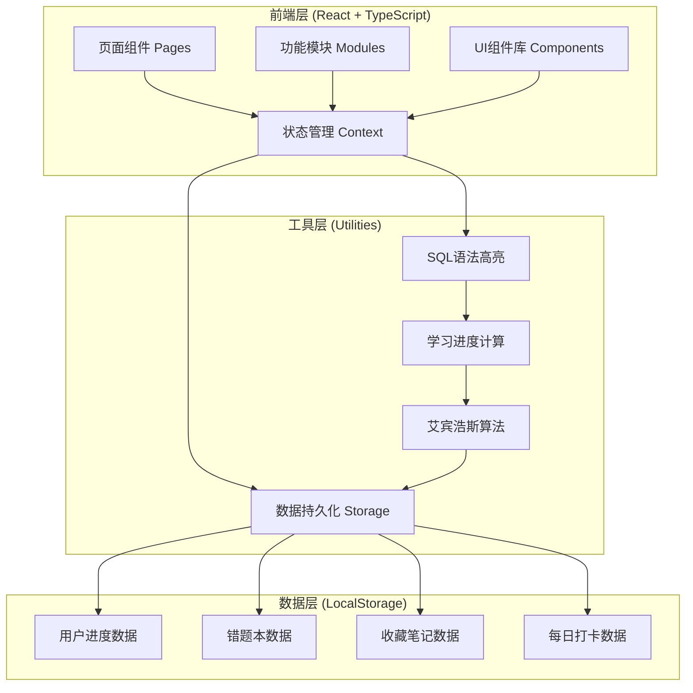
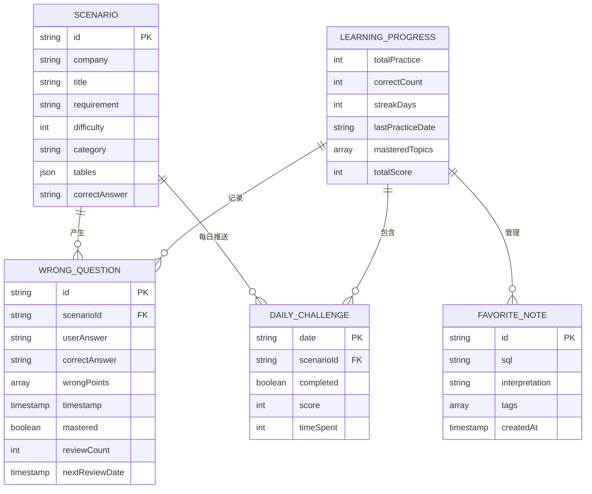
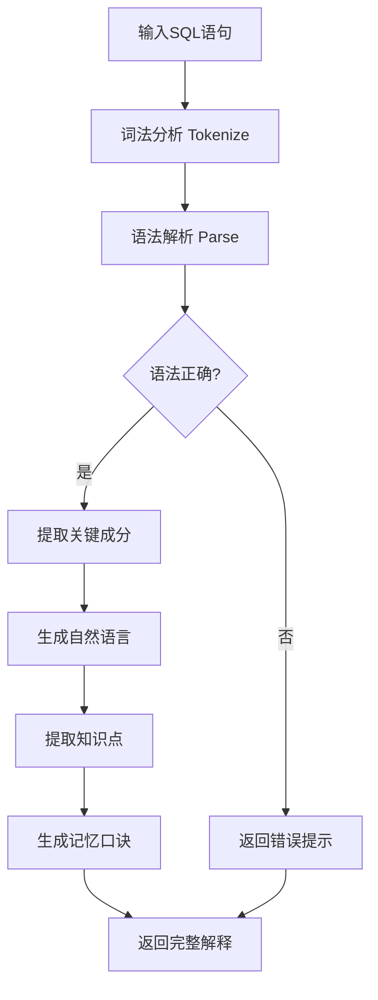
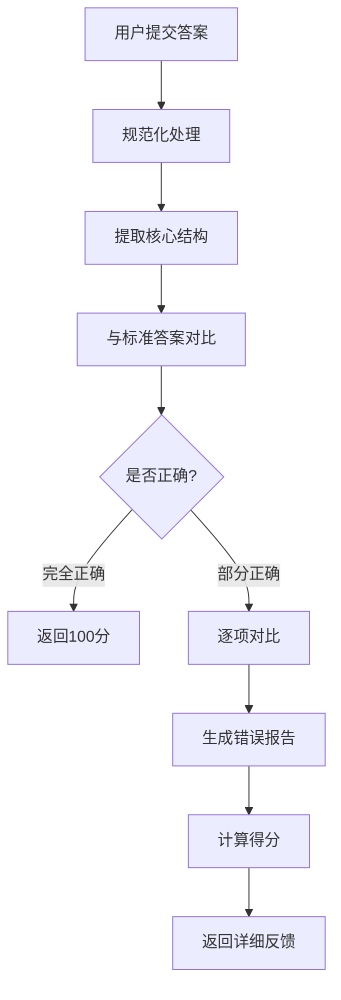
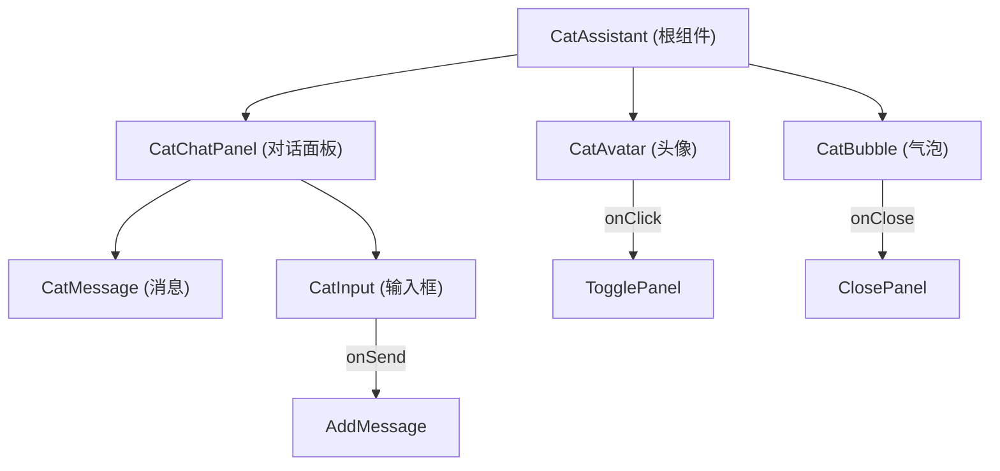
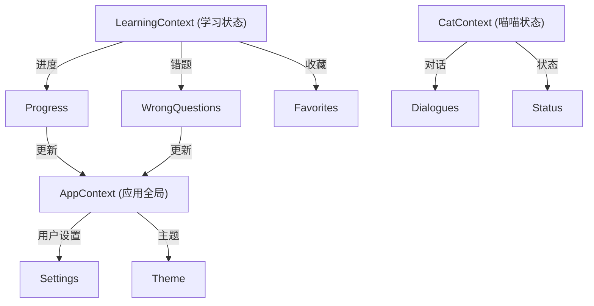

# MySQL面试训练营 - 技术架构文档

## 1. 架构设计

### 1.1 整体架构

本项目采用**单页应用（SPA）**架构，前端使用 React + TypeScript 构建，后端暂无（数据存储使用 localStorage）。整体架构分为三个主要层次：



### 1.2 目录结构

```
mysql-learning-platform/
├── public/
│   ├── index.html
│   └── assets/
│       └── cat.svg              # 喵喵猫咪SVG图
├── src/
│   ├── components/              # 通用组件
│   │   ├── Layout/               # 布局组件
│   │   │   ├── Header.tsx
│   │   │   ├── Footer.tsx
│   │   │   └── Navigation.tsx
│   │   ├── CatAssistant/         # 喵喵助手组件
│   │   │   ├── CatAvatar.tsx     # 喵喵头像
│   │   │   ├── CatBubble.tsx     # 喵喵气泡
│   │   │   └── CatChatPanel.tsx  # 对话面板
│   │   ├── CodeEditor/           # 代码编辑器
│   │   │   ├── SQLEditor.tsx
│   │   │   └── EditorToolbar.tsx
│   │   ├── Cards/                # 卡片组件
│   │   │   ├── FeatureCard.tsx
│   │   │   ├── ScenarioCard.tsx
│   │   │   └── QuestionCard.tsx
│   │   └── UI/                   # 基础UI组件
│   │       ├── Button.tsx
│   │       ├── Badge.tsx
│   │       ├── Progress.tsx
│   │       └── Tooltip.tsx
│   ├── pages/                    # 页面组件
│   │   ├── Home.tsx              # 首页
│   │   ├── SQLTranslator.tsx     # SQL翻译官
│   │   ├── PracticeArena.tsx     # 场景练习场
│   │   ├── Summary.tsx           # 规律总结
│   │   ├── WrongBook.tsx         # 错题本
│   │   └── DailyChallenge.tsx    # 每日挑战
│   ├── context/                  # React Context
│   │   ├── AppContext.tsx        # 全局状态
│   │   ├── LearningContext.tsx   # 学习进度
│   │   └── CatContext.tsx        # 喵喵状态
│   ├── hooks/                    # 自定义Hooks
│   │   ├── useLocalStorage.ts    # 本地存储
│   │   ├── useSQLParser.ts       # SQL解析
│   │   └── useSpacedRepetition.ts # 间隔重复
│   ├── data/                     # 静态数据
│   │   ├── scenarios.ts          # 场景题目库
│   │   ├── sqlKeywords.ts        # SQL关键词
│   │   ├── summaries.ts          # 知识点总结
│   │   └── catDialogues.ts       # 喵喵对话库
│   ├── utils/                    # 工具函数
│   │   ├── sqlFormatter.ts        # SQL格式化
│   │   ├── sqlInterpreter.ts     # SQL解释器
│   │   ├── answerChecker.ts      # 答案校验
│   │   └── spacedRepetition.ts   # 艾宾浩斯算法
│   ├── styles/                   # 全局样式
│   │   └── globals.css
│   ├── App.tsx                   # 根组件
│   └── main.tsx                  # 入口文件
├── package.json
├── tsconfig.json
├── vite.config.ts
├── tailwind.config.js
├── postcss.config.js
└── README.md
```

## 2. 技术栈详情

### 2.1 核心技术选型

| 技术类别 | 选型方案 | 版本号 | 说明 |
|---------|---------|--------|------|
| **框架** | React | 18.x | 组件化开发，用户界面构建 |
| **语言** | TypeScript | 5.x | 类型安全，提升代码质量 |
| **构建工具** | Vite | 5.x | 快速热更新，开发体验优秀 |
| **路由管理** | React Router | 6.x | SPA路由控制 |
| **样式方案** | Tailwind CSS | 3.x | 原子化CSS，快速构建UI |
| **状态管理** | React Context | 内置 | 轻量级状态管理 |
| **数据存储** | localStorage | 浏览器API | 本地持久化存储 |
| **动画效果** | Framer Motion | 11.x | 流畅的交互动画 |
| **图标库** | Lucide React | 最新 | 轻量级SVG图标 |
| **代码高亮** | Prism.js | 最新 | SQL语法高亮 |
| **字体** | Google Fonts | - | Noto Sans SC + Inter + JetBrains Mono |

### 2.2 依赖包清单

```json
{
  "dependencies": {
    "react": "^18.2.0",
    "react-dom": "^18.2.0",
    "react-router-dom": "^6.22.0",
    "framer-motion": "^11.0.0",
    "lucide-react": "^0.300.0",
    "prismjs": "^1.29.0",
    "clsx": "^2.1.0",
    "zustand": "^4.5.0"
  },
  "devDependencies": {
    "@types/react": "^18.2.0",
    "@types/react-dom": "^18.2.0",
    "@vitejs/plugin-react": "^4.2.0",
    "typescript": "^5.3.0",
    "vite": "^5.0.0",
    "tailwindcss": "^3.4.0",
    "postcss": "^8.4.0",
    "autoprefixer": "^10.4.0"
  }
}
```

## 3. 路由定义

### 3.1 路由结构

| 路由路径 | 页面名称 | 功能描述 | 权限 |
|---------|---------|---------|------|
| `/` | 首页 | Hero展示、功能入口、进度展示 | 公开 |
| `/translator` | SQL翻译官 | SQL语句解释 | 公开 |
| `/practice` | 场景练习场 | 场景列表 | 公开 |
| `/practice/:scenarioId` | 练习详情 | 单个场景练习 | 公开 |
| `/summary` | 规律总结 | 知识点汇总 | 公开 |
| `/wrongbook` | 错题本 | 错题记录和复习 | 公开 |
| `/daily` | 每日挑战 | 每日推送场景 | 公开 |

### 3.2 路由守卫

由于本期MVP版本无需登录，暂无路由守卫需求。后续版本如需添加：

```typescript
// 路由配置示例
const routes = [
  {
    path: '/',
    element: <Home />,
    meta: { title: '首页 - 喵SQL' }
  },
  {
    path: '/translator',
    element: <SQLTranslator />,
    meta: { title: 'SQL翻译官 - 喵SQL' }
  },
  // ... 其他路由
];
```

## 4. 数据模型定义

### 4.1 核心数据模型

```typescript
// 场景练习题
interface Scenario {
  id: string;                      // 唯一标识
  company: string;                  // 公司名称
  department: string;               // 部门
  title: string;                    // 场景标题
  background: string;               // 业务背景
  requirement: string;              // 具体需求
  difficulty: 1 | 2 | 3 | 4 | 5;    // 难度等级
  category: string;                 // 考点分类
  tables: TableSchema[];            // 涉及的表结构
  correctAnswer: string;            // 正确答案
  wrongPoints: string[];            // 常见错误点
  similarQuestions: string[];       // 同类变体题ID
}

// 数据库表结构
interface TableSchema {
  name: string;                    // 表名
  alias: string;                   // 中文别名
  columns: Column[];               // 字段列表
  sampleData?: Record<string, any>[]; // 示例数据
}

// 字段定义
interface Column {
  name: string;                    // 字段名
  type: string;                    // 数据类型
  description: string;            // 字段说明
  isPrimaryKey?: boolean;          // 是否主键
  isForeignKey?: boolean;           // 是否外键
  references?: string;              // 关联关系
}

// 错题记录
interface WrongQuestion {
  id: string;                      // 唯一标识
  scenarioId: string;              // 对应场景ID
  userAnswer: string;              // 用户答案
  correctAnswer: string;           // 正确答案
  wrongPoints: string[];           // 错误点分析
  timestamp: number;               // 记录时间
  mastered: boolean;               // 是否已掌握
  reviewCount: number;             // 复习次数
  lastReviewDate: number;          // 上次复习时间
  nextReviewDate: number;          // 下次复习时间
  easeFactor: number;              // 难度系数（艾宾浩斯）
}

// 学习进度
interface LearningProgress {
  totalPractice: number;          // 总练习次数
  correctCount: number;            // 正确次数
  wrongCount: number;              // 错误次数
  streakDays: number;              // 连续打卡天数
  lastPracticeDate: string;        // 最后练习日期
  masteredTopics: string[];        // 已掌握知识点
  dailyChallenges: DailyChallenge[]; // 每日挑战记录
  totalScore: number;              // 总积分
}

// 每日挑战记录
interface DailyChallenge {
  date: string;                    // 日期（YYYY-MM-DD）
  scenarioId: string;              // 挑战的场景ID
  completed: boolean;              // 是否完成
  score: number;                  // 得分
  timeSpent: number;               // 用时（秒）
}

// 收藏笔记
interface FavoriteNote {
  id: string;                      // 唯一标识
  sql: string;                     // SQL语句
  interpretation: string;         // 喵喵的解释
  tags: string[];                  // 标签
  createdAt: number;               // 收藏时间
}
```

### 4.2 数据关系图



## 5. 核心功能实现

### 5.1 SQL解释器模块

**文件路径**：`src/utils/sqlInterpreter.ts`

**核心功能**：
- 解析SQL语句结构（SELECT、FROM、WHERE、GROUP BY等）
- 生成自然语言解释
- 提取关键语法点
- 生成记忆口诀

**算法流程**：


**解释生成示例**：
```
输入: SELECT user_name, COUNT(*) as order_count 
      FROM orders 
      WHERE status = 'completed' 
      GROUP BY user_name 
      HAVING COUNT(*) > 5 
      ORDER BY order_count DESC 
      LIMIT 10;

输出:
{
  summary: "统计购买次数超过5次的用户，并按购买次数降序排列，只显示前10名",
  clauses: [
    { keyword: "SELECT", explanation: "选择要查询的字段：用户名和订单数量" },
    { keyword: "FROM", explanation: "从订单表中查询数据" },
    { keyword: "WHERE", explanation: "只统计状态为'已完成'的订单" },
    { keyword: "GROUP BY", explanation: "按用户名分组统计" },
    { keyword: "HAVING", explanation: "筛选购买次数大于5的用户" },
    { keyword: "ORDER BY", explanation: "按订单数量从多到少排序" },
    { keyword: "LIMIT", explanation: "只显示前10条结果" }
  ],
  keyPoints: [
    "WHERE vs HAVING: WHERE在分组前过滤，HAVING在分组后过滤",
    "聚合函数配合HAVING使用",
    "LIMIT限制返回行数"
  ],
  memoryTip: "分组聚合三步走：先筛选、再分组、后过滤（喵～）"
}
```

### 5.2 答案校验模块

**文件路径**：`src/utils/answerChecker.ts`

**核心功能**：
- 规范化SQL（去除多余空格、统一大小写）
- 提取SQL核心结构
- 对比用户答案与标准答案
- 生成详细错误报告

**校验策略**：


**错误类型分类**：
1. **语法错误**：关键词拼写错误、缺少括号、语句不完整
2. **逻辑错误**：条件写错、连接方式错误
3. **遗漏字段**：SELECT缺少字段、GROUP BY遗漏字段
4. **性能问题**：使用子查询而非JOIN、全表扫描
5. **语义错误**：查询结果正确但不符合题目要求

### 5.3 艾宾浩斯复习算法

**文件路径**：`src/utils/spacedRepetition.ts`

**核心逻辑**：
```typescript
// 基于艾宾浩斯遗忘曲线的复习间隔计算
function calculateNextReview(
  easeFactor: number,      // 难度因子（初始2.5）
  interval: number,        // 当前间隔（天）
  quality: number           // 答题质量（0-5）
): { interval: number; easeFactor: number; nextDate: Date } {
  
  // 质量 >= 3 表示掌握
  if (quality >= 3) {
    if (interval === 0) {
      interval = 1;
    } else if (interval === 1) {
      interval = 6;
    } else {
      interval = Math.round(interval * easeFactor);
    }
    // 答得越好，难度因子可以降低
    easeFactor = easeFactor - (0.8 - (5 - quality) * 0.08);
  } else {
    // 答得不好，重置间隔
    interval = 1;
    easeFactor = easeFactor - 0.2;
  }
  
  // 确保难度因子不低于1.3
  easeFactor = Math.max(1.3, easeFactor);
  
  const nextDate = new Date();
  nextDate.setDate(nextDate.getDate() + interval);
  
  return { interval, easeFactor, nextDate };
}
```

**复习提醒规则**：
- 当日应复习：错题.nextReviewDate === today
- 逾期未复习：错题.nextReviewDate < today
- 复习频率：当日复习后自动计算下次复习时间

## 6. 组件架构

### 6.1 喵喵助手组件树



### 6.2 核心组件接口

```typescript
// 喵喵助手组件
interface CatAssistantProps {
  position?: 'bottom-right' | 'bottom-left';
  greeting?: string;
  defaultOpen?: boolean;
}

// SQL编辑器组件
interface SQLEditorProps {
  value: string;
  onChange: (value: string) => void;
  placeholder?: string;
  height?: string;
  readOnly?: boolean;
}

// 场景卡片组件
interface ScenarioCardProps {
  scenario: Scenario;
  onStartPractice: (id: string) => void;
  isCompleted?: boolean;
  score?: number;
}

// 错题卡片组件
interface WrongQuestionCardProps {
  question: WrongQuestion;
  onReview: (id: string) => void;
  onDelete: (id: string) => void;
  onMarkMastered: (id: string) => void;
}
```

## 7. 状态管理架构

### 7.1 Context结构



### 7.2 状态管理实现

```typescript
// LearningContext 示例
interface LearningState {
  progress: LearningProgress;
  wrongQuestions: WrongQuestion[];
  favorites: FavoriteNote[];
  todayChallenge: Scenario | null;
}

interface LearningActions {
  addWrongQuestion: (question: WrongQuestion) => void;
  updateProgress: (updates: Partial<LearningProgress>) => void;
  markAsMastered: (id: string) => void;
  reviewQuestion: (id: string, quality: number) => void;
  addFavorite: (note: FavoriteNote) => void;
}
```

## 8. 性能优化策略

### 8.1 加载优化

| 优化项 | 实现方案 | 预期效果 |
|--------|---------|---------|
| 代码分割 | React.lazy + Suspense | 首屏加载减少60% |
| 路由懒加载 | 按路由分割代码 | 初始包体积 < 150KB |
| 图片优化 | SVG内联 + 懒加载 | 减少HTTP请求 |
| 依赖预加载 | Vite build优化 | 提升加载速度 |

### 8.2 运行时优化

```typescript
// 防抖搜索输入
const debouncedSearch = useMemo(
  () => debounce((query: string) => {
    // 执行搜索
  }, 300),
  []
);

// 虚拟列表（错题列表）
const VirtualList = ({ items }) => {
  return (
    <FixedSizeList
      height={600}
      itemCount={items.length}
      itemSize={100}
    >
      {({ index, style }) => (
        <WrongQuestionCard
          question={items[index]}
          style={style}
        />
      )}
    </FixedSizeList>
  );
};
```

## 9. 浏览器兼容性

| 浏览器 | 最低版本 | 备注 |
|--------|---------|------|
| Chrome | 90+ | 推荐 |
| Firefox | 88+ | 支持 |
| Safari | 14+ | 支持 |
| Edge | 90+ | 支持 |
| 移动端Safari | 14+ | 响应式支持 |
| Chrome Android | 90+ | 响应式支持 |

---

**文档版本**: v1.0.0  
**创建日期**: 2024年  
**最后更新**: 待定
